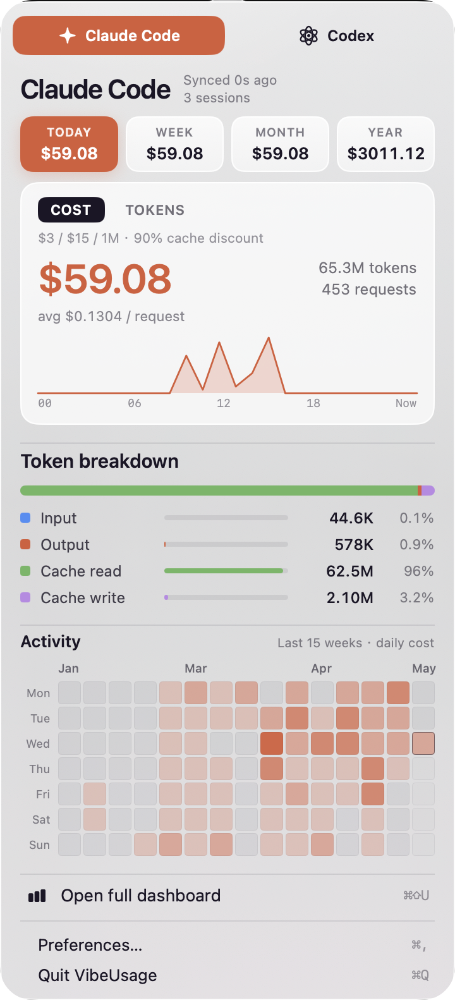
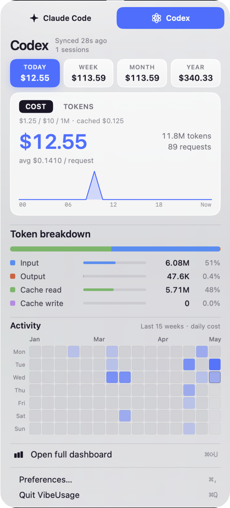
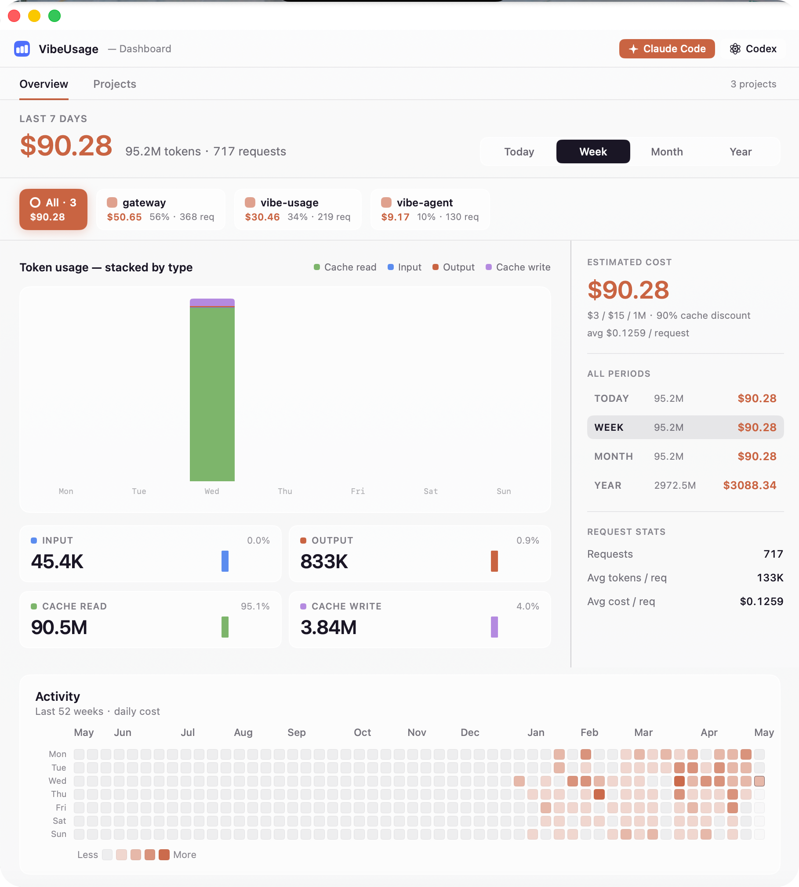

# VibeUsage

> A native macOS menu bar app that tracks your **Claude Code** and **Codex** CLI usage — tokens, costs, requests, sessions — with zero telemetry and no cloud sync.

[中文文档 / Chinese README](docs/README_zh.md)


---

## What it does

VibeUsage scans the session logs your AI coding CLIs already write to disk and gives you a clean, local-first dashboard of how much you've been spending:

- **Claude Code** — parses JSONL logs under `~/.claude/projects/`
- **Codex** — parses rollout files under `~/.codex/sessions/`

Everything runs locally. No account, no API keys, no network calls beyond `localhost`.

### Features

- **Menu bar popover** — at-a-glance totals for today / this week / this month / this year, with a Cost ⇄ Tokens hero toggle and an inline sparkline.
- **Full stats window** — hourly & daily stacked bar charts, token breakdown (input, output, cache read, cache write), per-request averages, cost trends, and a 52-week GitHub-style **activity heatmap**.
- **Per-project view** — switch between Overview and Projects tabs; filter the dashboard with one click via the project chip strip, or drill into a single repo with searchable / sortable master-detail (by cost, tokens, requests, recency or name), per-branch breakdown, and a one-click copy of the project path.
- **Dual tool support** — switch between Claude Code and Codex; see per-tool pricing (`$3 / $15 per 1M` for Claude with 90% cache discount, `$1.25 / $10 per 1M` for Codex with `$0.125` cached input) calculated automatically.
- **Incremental ingestion** — the Go backend watches log files and only processes the delta since the last tick, configurable from 30s / 1m / 5m.
- **Bilingual UI** — English / 中文, switchable in Preferences.
- **Configurable menu bar** — show icon only, today's cost, or token total; choose System / Light / Dark theme; launch at login.
- **Keyboard-friendly** — `⌘1` Overview, `⌘2` Projects, `Esc` clear filter, `⌘⇧U` open dashboard, `⌘,` preferences, `⌘Q` quit.
- **Self-contained `.app`** — the SwiftUI bundle ships the Go backend binary; nothing else to install.

---

## Screenshots

| Menu bar — Claude Code | Menu bar — Codex |
|---|---|
|  |  |

Full dashboard:



---

## Requirements

- macOS **26.0+** (Tahoe)
- Xcode command line tools (Swift 6.2 toolchain)
- Go **1.25+** (only required if you build from source)
- Claude Code and/or Codex CLI, with their default session directories populated

---

## Install

### From source

```bash
git clone https://github.com/yeatesss/vibe-usage.git
cd vibe-usage
make install     # builds everything, signs ad-hoc, copies to /Applications
```

Then launch **VibeUsage** from Spotlight / Launchpad. Look for the icon in your menu bar.

### Build a DMG

```bash
make dmg         # produces dist/VibeUsage-<version>.dmg
```

To sign with your own Developer ID:

```bash
make app CODESIGN_ID="Developer ID Application: Your Name (TEAMID)"
```

---

## Development

```bash
make dev         # runs Go backend + SwiftUI frontend against .tmp/dev data dir
make test        # swift test
make backend-test
make backend-vet
```

Common targets:

| Target | Description |
|---|---|
| `make build` | Debug build of the Swift app |
| `make release` | Release build |
| `make app` | Assemble `dist/VibeUsage.app` (release + backend + icon, code-signed) |
| `make dmg` | Build a distributable DMG with an `Applications` symlink |
| `make install` / `make uninstall` | Copy the `.app` to `/Applications` |
| `make clean` / `make distclean` | Clean build outputs |

Run `make help` for the full list.

---

## Architecture

```
┌────────────────────────┐      HTTP (localhost)     ┌──────────────────────────┐
│  SwiftUI menu bar app  │ ───────────────────────▶  │  vibeusage-backend (Go)  │
│  Sources/Usage/        │                           │  backend/                │
└────────────────────────┘                           └──────────────────────────┘
                                                                │
                                                                │ reads JSONL
                                                                ▼
                                                  ~/.claude/projects/**/*.jsonl
                                                  ~/.codex/sessions/**/*.jsonl
                                                                │
                                                                ▼
                                       ~/Library/Application Support/VibeUsage/
                                               (SQLite + runtime.json)
```

- **Frontend** (`Sources/Usage/`, Swift 6.2 / SwiftUI, macOS 26+): menu bar controller, popover, full stats window, project master-detail, settings window, Swift Charts rendering, activity heatmap.
- **Backend** (`backend/`, Go 1.25, Gin + modernc SQLite): tails session logs, normalizes per-tool event shapes, computes cost from `pricing/`, exposes `/usage`, `/usage/heatmap`, `/usage/projects`, `/health`, `/version`, `/config/tick`.
- **IPC**: the backend writes a `runtime.json` with port + pid into the data dir; the app reads it to connect. In packaged mode the Swift app spawns the bundled backend binary; in `make dev` the backend is run separately and the spawn is skipped.

Data directory (override with `VIBEUSAGE_DATA_DIR`):

```
~/Library/Application Support/VibeUsage/
├── runtime.json        # port, pid, version
├── vibeusage.db        # SQLite store
└── logs/               # backend logs
```

---

## Configuration

Most settings live in **Preferences** (`⌘,`) — language, refresh interval (30s / 1m / 5m), launch at login, menu bar display, theme, and data-source connectivity.

The backend also picks up these environment variables and flags:

| Variable | Flag | Default |
|---|---|---|
| `VIBEUSAGE_DATA_DIR` | `--data-dir` | `~/Library/Application Support/VibeUsage` |
| `VIBEUSAGE_CLAUDE_DIR` | `--claude-dir` | `~/.claude/projects` |
| `VIBEUSAGE_CODEX_DIR` | `--codex-dir` | `~/.codex/sessions` |
| — | `--tick` | ingestion interval (e.g. `10s`) |
| — | `--log-level` | `info` / `debug` |

---

## Privacy

VibeUsage only reads files that already exist on your machine. It never makes outbound network requests — the only HTTP server it runs is bound to `localhost` for the SwiftUI app. There is no analytics, no telemetry, no account.

---

## License

See the repository for license terms.
