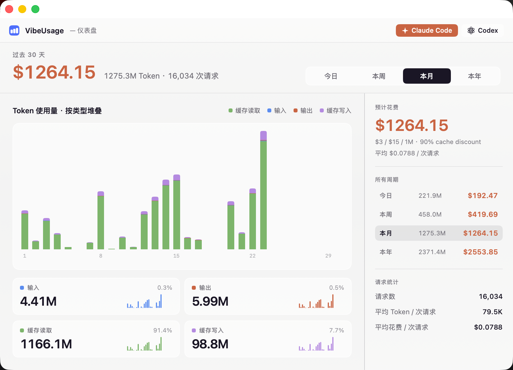
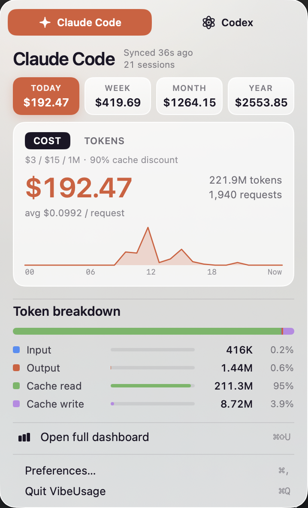

# VibeUsage

> 一个原生的 macOS 菜单栏应用，用来统计你的 **Claude Code** 与 **Codex** CLI 用量 —— token、费用、请求数、会话数。无遥测、无云同步，全部数据留在本地。

[English README](../README.md)



---

## 它做什么

VibeUsage 读取你的 AI 编码 CLI 已经写在磁盘上的会话日志，给你一个简洁、完全本地的用量仪表盘：

- **Claude Code** — 解析 `~/.claude/projects/` 下的 JSONL 日志
- **Codex** — 解析 `~/.codex/sessions/` 下的 rollout 文件

全部在本地运行。不需要账号、不需要 API Key，也不会有任何跨出 `localhost` 的网络请求。

### 功能

- **菜单栏面板** — 一眼看到今天 / 本周 / 本月 / 今年的用量合计。
- **完整统计窗口** — 按小时/按天的柱状图、token 分类（输入、输出、缓存读、缓存写）、单请求平均值、费用趋势。
- **双工具支持** — 在 Claude Code 与 Codex 之间切换；各自的定价独立展示（Claude `$3/$15 per 1M`、Codex `$1.25/$10 per 1M`），缓存折扣会自动计算。
- **增量采集** — Go 后端监听日志文件，每个 tick 只处理增量，CPU 占用极低。
- **自包含 `.app`** — SwiftUI 前端的 `.app` 里直接打包了 Go 后端二进制，不需要单独安装任何服务。

---

## 截图

| 菜单栏面板 | 完整统计窗口 |
|---|---|
|  |  |

---

## 运行要求

- macOS **26.0+**（Tahoe）
- Xcode 命令行工具（Swift 6.2 工具链）
- Go **1.25+**（仅源码构建需要）
- 本机已装 Claude Code 和/或 Codex CLI，并有一定使用记录

---

## 安装

### 源码构建

```bash
git clone https://github.com/yeatesss/vibe-usage.git
cd vibe-usage
make install     # 一键构建 + ad-hoc 签名 + 拷贝到 /Applications
```

然后通过 Spotlight 或 Launchpad 启动 **VibeUsage**，菜单栏会出现图标。

### 打包 DMG

```bash
make dmg         # 输出 dist/VibeUsage-<version>.dmg
```

使用自己的 Developer ID 签名：

```bash
make app CODESIGN_ID="Developer ID Application: Your Name (TEAMID)"
```

---

## 开发

```bash
make dev         # 同时启动 Go 后端与 SwiftUI 前端，数据目录隔离在 .tmp/dev
make test        # swift test
make backend-test
make backend-vet
```

常用目标：

| 目标 | 说明 |
|---|---|
| `make build` | 调试构建 Swift 应用 |
| `make release` | Release 构建 |
| `make app` | 组装 `dist/VibeUsage.app`（release + 后端 + 图标，含签名） |
| `make dmg` | 生成带 `Applications` 软链的分发 DMG |
| `make install` / `make uninstall` | 安装/卸载到 `/Applications` |
| `make clean` / `make distclean` | 清理构建产物 |

`make help` 查看完整列表。

---

## 架构

```
┌────────────────────────┐    HTTP (localhost)    ┌──────────────────────────┐
│  SwiftUI 菜单栏应用     │ ─────────────────────▶ │  vibeusage-backend (Go)  │
│  Sources/Usage/        │                        │  backend/                │
└────────────────────────┘                        └──────────────────────────┘
                                                              │
                                                              │ 读取 JSONL
                                                              ▼
                                               ~/.claude/projects/**/*.jsonl
                                               ~/.codex/sessions/**/*.jsonl
                                                              │
                                                              ▼
                                     ~/Library/Application Support/VibeUsage/
                                             (SQLite + runtime.json)
```

- **前端**（`Sources/Usage/`，Swift 6.2 / SwiftUI，macOS 26+）：菜单栏控制器、popover、完整统计窗口、Swift Charts 渲染。
- **后端**（`backend/`，Go 1.25，Gin + modernc SQLite）：跟踪会话日志、将不同工具的事件结构归一化、调用 `pricing/` 计算费用、提供 `/usage`、`/health`、`/version` 接口。
- **进程间通信**：后端启动后会把端口、pid 写入数据目录的 `runtime.json`，前端据此连接。打包模式下由 Swift 应用派生内嵌的后端进程；`make dev` 时后端独立运行，前端检测到存活就不会重复拉起。

数据目录（可通过 `VIBEUSAGE_DATA_DIR` 覆盖）：

```
~/Library/Application Support/VibeUsage/
├── runtime.json        # 端口、pid、版本
├── vibeusage.db        # SQLite 数据库
└── logs/               # 后端日志
```

---

## 配置项

后端接受以下环境变量与命令行参数：

| 环境变量 | 命令行参数 | 默认值 |
|---|---|---|
| `VIBEUSAGE_DATA_DIR` | `--data-dir` | `~/Library/Application Support/VibeUsage` |
| `VIBEUSAGE_CLAUDE_DIR` | `--claude-dir` | `~/.claude/projects` |
| `VIBEUSAGE_CODEX_DIR` | `--codex-dir` | `~/.codex/sessions` |
| — | `--tick` | 采集间隔，例如 `10s` |
| — | `--log-level` | `info` / `debug` |

---

## 隐私

VibeUsage 只读取你机器上已经存在的文件；不会向任何外部服务发请求 —— 它唯一起的 HTTP 服务只绑定在 `localhost`，给本地 SwiftUI 应用用。没有埋点、没有遥测、没有账号体系。

---

## 许可证

参见仓库根目录的授权说明。
